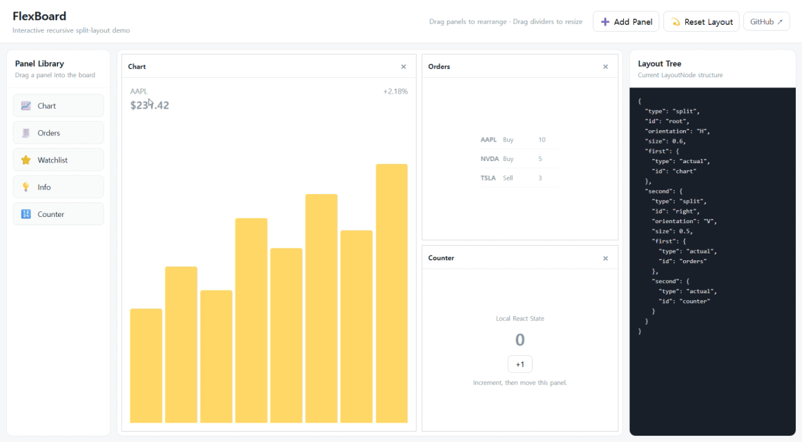

# FlexBoard

A framework-agnostic recursive split-layout engine with adapters for React and Vue.

Build interactive layouts where users can resize, move, add, and remove panels dynamically.

<p align="center">
  
</p>

## Features

- 🧩 **Recursive split layouts** — Build deeply nested layouts from a simple tree structure.
- ↔️ **Resizable panels** — Resize panels interactively using draggable dividers.
- 🖱️ **Drag and drop** — Move panels around the layout with drop previews.
- ➕ **Dynamic panels** — Add and remove panels programmatically.
- 🧠 **State preservation** — Surviving panel components retain their local state when the layout changes.
- ⚛️ **React support** — Use FlexBoard through `@flexboard/react`.
- 💚 **Vue support** — Use FlexBoard through `@flexboard/vue`.
- 🧱 **Framework-agnostic core** — Layout calculations and tree operations live in a pure TypeScript package.

## Packages

FlexBoard is organized as a monorepo containing a framework-agnostic core and framework adapters.

| Package            | Description                                |
| ------------------ | ------------------------------------------ |
| `@flexboard/core`  | Framework-agnostic recursive layout engine |
| `@flexboard/react` | React adapter for FlexBoard                |
| `@flexboard/vue`   | Vue adapter for FlexBoard                  |

```text
                    @flexboard/core
                           │
              ┌────────────┴────────────┐
              │                         │
      @flexboard/react          @flexboard/vue
```

The core package owns the layout model and operations, while the React and Vue packages handle framework-specific rendering and interaction.

## Installation

### React

```bash
npm install @flexboard/react
```

```tsx
import { FlexBoard, type LayoutNode } from "@flexboard/react";
```

### Vue

```bash
npm install @flexboard/vue
```

```ts
import { FlexBoard, type LayoutNode } from "@flexboard/vue";
```

You normally only need to install the adapter for your framework. `@flexboard/core` is installed automatically as a dependency.

## Quick Start

A FlexBoard layout is represented by a recursive `LayoutNode`.

```ts
const initialLayout: LayoutNode = {
  type: "split",
  id: "root",
  orientation: "H",
  size: 0.6,

  first: {
    type: "actual",
    id: "chart",
  },

  second: {
    type: "split",
    id: "right",
    orientation: "V",
    size: 0.5,

    first: {
      type: "actual",
      id: "orders",
    },

    second: {
      type: "actual",
      id: "info",
    },
  },
};
```

This tree represents a layout like:

```text
┌──────────────────────┬────────────────┐
│                      │     orders     │
│        chart         ├────────────────┤
│                      │      info      │
└──────────────────────┴────────────────┘
```

### React

```tsx
import { useState } from "react";

import { FlexBoard, type LayoutNode } from "@flexboard/react";

export default function App() {
  const [layout, setLayout] = useState<LayoutNode>(initialLayout);

  return (
    <div style={{ width: "100%", height: "600px" }}>
      <FlexBoard
        layout={layout}
        onLayoutChange={setLayout}
        renderPanel={({ id }) => <div>{id}</div>}
      />
    </div>
  );
}
```

### Vue

```vue
<script setup lang="ts">
import { ref } from "vue";

import { FlexBoard, type LayoutNode } from "@flexboard/vue";

const layout = ref<LayoutNode>(initialLayout);
</script>

<template>
  <div style="width: 100%; height: 600px">
    <FlexBoard v-model:layout="layout">
      <template #panel="{ id }">
        <div>{{ id }}</div>
      </template>
    </FlexBoard>
  </div>
</template>
```

## Recursive Layout Model

The main idea behind FlexBoard is that a layout is not represented as a fixed collection of rows and columns.

Instead, it is represented as a **recursive binary split tree**.

There are two kinds of nodes:

```ts
interface ActualNode {
  type: "actual";
  id: string;
}

interface SplitNode {
  type: "split";
  id: string;
  orientation: "H" | "V";
  first: LayoutNode;
  second: LayoutNode;
  size: number;
}

type LayoutNode = ActualNode | SplitNode;
```

An `ActualNode` represents a panel.

A `SplitNode` divides its available area into two children, and each child can itself be another `SplitNode`.

```text
                    Split
                   /     \
              Panel       Split
                         /     \
                    Panel       Split
                               /     \
                          Panel       Panel
```

Because the structure is recursive, FlexBoard can represent arbitrarily nested panel layouts using the same small set of primitives.

The same tree is used as the basis for:

- layout geometry calculation
- divider positioning
- resizing
- panel insertion
- panel removal
- panel movement
- drag-and-drop targeting

## Layout Operations

Common tree operations are exposed through the framework packages as well as `@flexboard/core`.

### Add a panel

```ts
import { addPanelToLayout } from "@flexboard/react";

setLayout((current) => addPanelToLayout(current, "new-panel"));
```

Vue:

```ts
import { addPanelToLayout } from "@flexboard/vue";

layout.value = addPanelToLayout(layout.value, "new-panel");
```

### Remove a panel

React:

```ts
import { removePanel } from "@flexboard/react";

setLayout((current) => {
  const next = removePanel(current, "orders");

  return next ?? current;
});
```

Vue:

```ts
import { removePanel } from "@flexboard/vue";

const next = removePanel(layout.value, "orders");

if (next) {
  layout.value = next;
}
```

Additional tree operations are available for inserting and moving panels:

```ts
insertPanelNear;
movePanel;
```

## Architecture

FlexBoard separates layout logic from framework rendering.

```text
┌─────────────────────────────────────────────┐
│              React / Vue Adapter            │
│                                             │
│  Components · Hooks/Composables · Events   │
└──────────────────────┬──────────────────────┘
                       │
                       ▼
┌─────────────────────────────────────────────┐
│              @flexboard/core                │
│                                             │
│  Tree Operations                            │
│  Geometry Calculation                       │
│  Drag & Drop Targeting                      │
│  Divider Resizing                           │
└─────────────────────────────────────────────┘
```

`@flexboard/core` contains no React or Vue dependencies.

The framework adapters consume the same layout engine, allowing both implementations to share the same layout behavior and data model.

## Repository Structure

```text
flexboard/
├── packages/
│   ├── core/
│   │   └── src/
│   │       ├── dnd/
│   │       ├── geometry/
│   │       ├── resize/
│   │       ├── tree/
│   │       ├── types/
│   │       └── utils/
│   │
│   ├── react/
│   │   └── src/
│   │       ├── components/
│   │       ├── hooks/
│   │       └── types/
│   │
│   └── vue/
│       └── src/
│           ├── components/
│           ├── composables/
│           └── types/
│
├── examples/
├── package.json
└── pnpm-workspace.yaml
```

## Development

Install dependencies:

```bash
pnpm install
```

Run type checks:

```bash
pnpm typecheck
```

Run tests:

```bash
pnpm test
```

Build all packages:

```bash
pnpm build
```

## License

MIT
